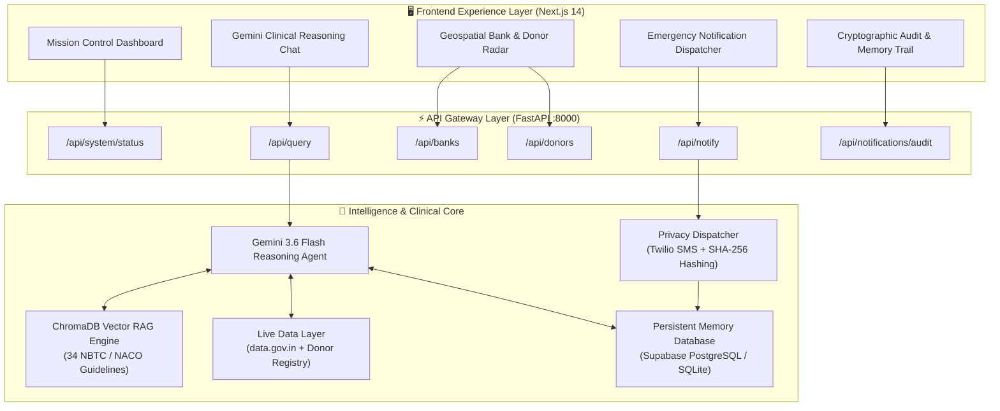

# O-Negative — System Architecture & Product Blueprint for UI/UX Design

> **Document Type**: Comprehensive Product & Technical Design Specification (PRD / Architecture Blueprint)  
> **Target Audience**: Lead UI/UX Designers, Product Architects, Generative Design Agents (Figma AI, Galileo AI, v0, Stitch)  
> **System Purpose**: Mission-critical AI blood coordination and clinical donor eligibility platform for India  
> **Core Tech Stack**: Next.js 14, Tailwind CSS, FastAPI, Google Gemini 3.6 Flash, ChromaDB Vector RAG, Supabase/SQLite, Twilio Dispatcher  

---

## 1. Executive Product Vision & Problem Space

### 1.1 The Real-World Emergency Problem
In India, finding emergency blood during critical trauma, surgery, or thalassemia crises is often chaotic. India's official blood banking repository (eRaktKosh) provides no real-time public developer API, and public blood banks rarely have visibility into **which voluntary donors are currently healthy, nearby, and eligible to donate right now**. Families are forced to panic-post unverified requests on WhatsApp and social media, exposing private phone numbers to scams and contacting donors who are clinically ineligible (e.g., recent antibiotic intake, recent tattoo, insufficient wait interval).

### 1.2 The O-Negative Solution
**O-Negative** is not merely a blood bank locator. It is an **AI-Driven Clinical Triage & Emergency Coordination Bridge** that:
1. **Understands Natural Language Emergencies**: Deciphers urgent, emotional, and complex clinical queries using **Google Gemini 3.6 Flash**.
2. **Enforces Clinical Rigor via RAG**: Verifies donor eligibility in real time against 34 authoritative clinical guidelines from the **National Blood Transfusion Council (NBTC)**, **National AIDS Control Organisation (NACO)**, and **WHO**.
3. **Calculates Geospatial Proximity**: Identifies verified blood banks and active donors within real-time driving radius.
4. **Learns Donor Reliability via Memory**: Ranks candidate donors using historical response rates, response latency, and successful donations stored in persistent memory.
5. **Dispatches Secure Emergency Alerts**: Sends privacy-preserving notifications with cryptographic **SHA-256 phone hashing**, preventing donor harassment.
6. **Maintains 100% Explainability**: Exposes a step-by-step clinical reasoning trail and confidence score for medical review.

---

## 2. User Personas & High-Stakes Mental Models

The UI/UX design team must design for high cognitive stress, life-or-death time pressure, and deep clinical scrutiny:

| Persona | Role & Context | Core Mental Model & Need | Key UI Challenge |
|---|---|---|---|
| **Dr. Priya / ER Resident** | Emergency Physician or ICU Nurse in an active surgery/trauma | *"I need 2 units of O- Negative blood in 40 minutes. Give me verified banks, nearest donors, and contact routes instantly."* | Zero cognitive friction. Instant visual hierarchy, 1-click calls, real-time distance and blood group badges. |
| **Rajesh / Panicked Caregiver** | Family member whose relative was in an accident | Anxious, overwhelmed, unfamiliar with medical jargon. Asking questions like *"Can my brother donate? He had an antibiotic 3 days ago."* | Empathetic, crystal-clear answers (Eligible vs Deferral), clear instructions, no medical ambiguity. |
| **Arjun / Active Voluntary Donor** | Verified voluntary donor registered in the network | Wants to help save lives, but values privacy and cannot receive spam while at work. | 1-tap "Available Now" toggle, privacy proof (masked number), actionable alerts with bank destination. |
| **Sunita / Blood Bank Administrator** | Hospital Blood Bank Manager (Sonipat / Delhi NCR) | Needs to monitor stock alerts, verify incoming donors, and view dispatch logs. | Real-time radar of incoming donors, contact history, bank verification status. |
| **Dr. Verma / Clinical Auditor** | Medical Compliance & Quality Assurance Officer | Inspects AI decisions to prevent transfusion reactions or guideline violations. | Collapsible, verifiable reasoning trails, guideline rule citations (NBTC/NACO clause numbers), audit logs. |

---

## 3. End-to-End System Architecture & Data Pipeline



---

## 4. Information Architecture & Core Screens Taxonomy

The design team should envision a **High-Performance Emergency Command Center** layout with clear visual hierarchy, dynamic responsive modes (Desktop Operations Console vs. Mobile Emergency Responder), and tabbed or panelized workflows:

### Screen 1: Command Center & Triage Dashboard ("Mission Control")
- **Primary Goal**: Immediate real-time situational awareness for healthcare workers and coordinators.
- **Key Modules**:
  1. **Top Telemetry Header**:
     - System Status Badge (`READY` / `LIVE`)
     - AI Reasoning Engine Status (`Gemini 3.6 Flash` indicator with active pulse)
     - Clinical Knowledge Base (`34 NBTC Rules Vectorized`)
     - Memory Engine (`PostgreSQL/Supabase Active` or `Local SQLite High-Speed`)
     - Notification Mode (`Sandbox Simulation` / `Live Twilio`)
     - Location & Emergency Blood Group Selectors (e.g., `Sonipat, Haryana`, Blood Group: `O-`, `A+`, `B+`, `AB-`)
  2. **Emergency Triage KPI Bar**:
     - Nearby Verified Blood Banks count & shortest travel distance (e.g., `3 Banks Found | Nearest 2.3 km`)
     - Active Standby Donors count in radius (e.g., `2 Available Donors`)
     - Average Network Response Time (e.g., `10 mins avg response`)
     - Active Emergency Queries processed today

### Screen 2: Conversational Clinical Reasoning Center ("AI Agent Chat")
- **Primary Goal**: Interacting with the AI clinical orchestrator for both immediate blood requests and complex donor eligibility queries.
- **Key Modules**:
  1. **Quick-Prompt Emergency Pills**:
     - *"Can I donate blood if I'm currently taking antibiotics?"*
     - *"My cousin gave blood a month ago and is on antibiotics right now. Can he donate again?"*
     - *"I need O- blood urgently in Sonipat. Who can help?"*
     - *"What is the deferral period after getting a tattoo or piercing?"*
  2. **Message Stream**:
     - **User Prompt Bubble**: Timestamped user query with blood group and location metadata.
     - **Agent Clinical Recommendation Card**:
       - Overall Decision Banner: `ELIGIBLE` (Emerald), `TEMPORARY DEFERRAL` (Amber), `PERMANENT DEFERRAL` (Rose), or `EMERGENCY DISPATCH INITIATED` (Crimson).
       - Authoritative Markdown Response with clinical guidelines and next steps.
       - **AI Confidence Gauge / Badge**: Visual score from `0%` to `100%` (e.g., `95% Clinical Confidence`).
  3. **Expandable Step-by-Step Clinical Reasoning Trail (Accordion)**:
     - *Step 1: Request Parsing & Intent Extraction* (Blood group, emergency level, location, medical context).
     - *Step 2: Vector RAG Retrieval* (Exact NBTC/NACO rule citation, guideline section, rule text).
     - *Step 3: Live Geospatial & Inventory Query* (Nearby verified banks and registered active donors).
     - *Step 4: Memory Reliability Ranking* (Donor historical response rate %, past alerts answered).
     - *Step 5: Recommendation Synthesis* (Gemini medical deduction logic).
  4. **Actionable Candidates Embedded Cards**:
     - Direct cards for matching Blood Banks (Bank name, address, distance in km, phone contact button).
     - Direct cards for top-ranked eligible donors with 1-click `Dispatch Emergency Alert` button.

### Screen 3: Geospatial Radar & Live Donor / Bank Roster
- **Primary Goal**: Exploring nearby blood banking facilities and managing the active donor pool.
- **Key Modules**:
  1. **Blood Banks Directory View**:
     - Filter by radius (5 km, 10 km, 25 km, 50 km).
     - Card view with Verified Government Registry badge (`data.gov.in`), address, contact numbers, and Google Maps calculated driving distance.
  2. **Live Donor Registry & Reliability Matrix**:
     - Donor Card with anonymized ID (`donor_sonipat_001`), blood group badge, general vicinity (`Sonipat`).
     - **Reliability Rating Meter**: Visual progress bar of response success (e.g., `90% Response Rate - 80 Past Alerts`).
     - Status Indicator: `Available Now` (Green pulse) vs `Recently Donated` vs `Unavailable`.
     - **Quick Availability Toggle**: Allows instant status switching for registered donors.

### Screen 4: Emergency Notification Dispatcher & Sandbox Console
- **Primary Goal**: Triggering and previewing outbound emergency alerts across SMS and WhatsApp.
- **Key Modules**:
  1. **Dispatch Configuration Form**:
     - Target Recipient Type: `Donor Request`, `Patient Update`, `Blood Bank Alert`.
     - Recipient Name & Anonymized Phone Preview (`***-***-3210`).
     - Blood Group & Location Selector.
     - Automated Message Preview with dynamic variable interpolation (Patient name, blood bank address, urgency).
  2. **Emergency Dispatch Action**:
     - High-urgency action button (`Dispatch Live Alert`).
     - Sandbox safety badge indicating zero SMS charges during simulation.

### Screen 5: Privacy-Preserving Audit Trail & Clinical Governance
- **Primary Goal**: Complete regulatory compliance, medical auditability, and data privacy verification.
- **Key Modules**:
  1. **Audit Metric Cards**:
     - Total Alerts Dispatched, SMS vs WhatsApp breakdown, Success Delivery Rate (100%).
  2. **Cryptographic Log Table**:
     - Timestamp (ISO with seconds).
     - Event Type (`donor_request`, `patient_update`).
     - **Cryptographic Hash**: Visual truncation of SHA-256 phone hash (e.g., `b6adb97...08a195`) with click-to-copy.
     - Masked Display Number (`***-***-3210`).
     - Dispatch Mode (`sandbox` / `live_carrier`).
     - Message Preview with modal expander for full clinical message inspection.

---

## 5. Visual Hierarchy, Design Directives & Emotional UX

The design team should not build a generic corporate or clinical dashboard. This is a **life-critical emergency coordination system**. The aesthetic should evoke **calm precision, clinical authority, and high-tech urgency**.

### 5.1 Emotional Design Pillars
1. **Urgency Without Panic**: High contrast, bold typographic hierarchy, and clear color coding that immediately draws the eye to actionable information (e.g., nearest bank, donor phone, eligibility status).
2. **Clinical Trust & Defensibility**: The AI must not feel like a chatbot hallucinating answers. It must feel like an authoritative digital clinical officer, backed by cited NBTC guidelines and transparent deduction trails.
3. **Ironclad Privacy Aesthetics**: Visual emphasis on security: SHA-256 hash badges, masked numbers, no plaintext PII. The user should feel that their data is rigorously protected.
4. **Zero-Latency Feel**: Optimistic UI states, skeleton loaders, and micro-animations on badges (e.g., pulsing green dot for live donors).

### 5.2 Key Color Palette Archetypes (Suggested)
- **Emergency Crimson & Blood Red**: Primary action, emergency alerts, blood group pills (Hex: `#DC2626` / `#EF4444`).
- **Deep Slate / Navy Dark Canvas**: Deep, modern, eye-strain-reducing backdrop for hospital lighting and high-contrast telemetry (Hex: `#020617` / `#0F172A`).
- **Clinical Emerald**: Eligibility approved, verified banks, available donors, high reliability (Hex: `#059669` / `#10B981`).
- **Cautionary Amber**: Temporary deferral period, wait interval warning, antibiotics cooldown (Hex: `#D97706` / `#F59E0B`).
- **Clinical Cyan / Violet**: AI reasoning active, Gemini telemetry, vector search indicators (Hex: `#06B6D4` / `#8B5CF6`).

---

## 6. Complete Data Contracts (Backend API Payloads)

These exact JSON schemas define what the backend delivers to the UI components. Design tools (such as Figma AI or generative frontends) can use these schemas directly for mock data generation:

### 6.1 System Status (`GET /api/system/status`)
```json
{
  "status": "ready",
  "llm_engine": "gemini-3.6-flash",
  "llm_active": true,
  "rag_status": "Active (ChromaDB Vector Store)",
  "memory_backend": "sqlite",
  "notification_mode": "sandbox",
  "notification_count": 1
}
```

### 6.2 Clinical Query & Emergency Match (`POST /api/query`)
**Request:**
```json
{
  "query": "Can I donate blood if I took amoxicillin antibiotics yesterday?",
  "location": "Sonipat",
  "blood_group": "O-",
  "user_type": "donor"
}
```
**Response:**
```json
{
  "recommendation": "Hello! I am O-Negative, your AI-driven clinical assistant for blood coordination.\n\n### Eligibility Decision: Currently Not Eligible\n**No, you cannot donate blood today.**\n\n### Clinical Guideline & Waiting Period\nAccording to NACO & NBTC Medication Guidelines (Section 4.1):\n* Donors taking antibiotics must wait at least 48 hours after completing the full course.\n...",
  "confidence": 0.95,
  "reasoning_trail": [
    {
      "step": "parse_request",
      "reasoning": [
        "Detected: donor eligibility question",
        "Context: donor on antibiotics (requires 48-72 hr deferral)"
      ]
    },
    {
      "step": "retrieve_eligibility_rules",
      "reasoning": [
        "RAG search query: 'antibiotics on_medication'",
        "Retrieved 3 relevant clinical rules from ChromaDB vector index",
        "Matched rule: NACO Medication Guidelines, Section 4.1",
        "Matched rule: NBTC Guidelines, Section 4.3"
      ]
    },
    {
      "step": "query_live_data",
      "reasoning": [
        "Queried data.gov.in directory: found 3 blood banks within 25km of Sonipat",
        "Queried donor availability DB: found 2 available O- donors in Sonipat"
      ]
    },
    {
      "step": "rank_candidates",
      "reasoning": [
        "Memory-based ranking applied across 2 donors:",
        "  → donor_sonipat_001: 90% historical response rate (80 past alerts)",
        "  → donor_sonipat_002: 40% historical response rate (80 past alerts)"
      ]
    },
    {
      "step": "generate_recommendation",
      "reasoning": ["Synthesized clinical response via gemini-3.6-flash"],
      "confidence": 0.95
    }
  ],
  "parsed_request": {
    "request_type": "donor_eligibility",
    "blood_group": "O-",
    "location": "Sonipat",
    "context": "on_medication (antibiotics)"
  },
  "eligible_donors": [
    {
      "donor_id": "donor_sonipat_001",
      "blood_group": "O-",
      "approx_location": "Sonipat",
      "availability_status": "available",
      "last_status_update": "2026-09-17 06:10:06",
      "reliability_rate": 0.9,
      "response_count": 80,
      "avg_response_time": 10
    }
  ],
  "eligible_banks": [
    {
      "bank_id": "bank_001",
      "bank_name": "Apollo Blood Bank - Sonipat",
      "address": "Near Civil Hospital, Sonipat, Haryana 131001",
      "geo": { "lat": 29.0145, "lng": 77.0144 },
      "contact": "0130-2241000",
      "distance_km": 2.3
    },
    {
      "bank_id": "bank_002",
      "bank_name": "Red Cross Blood Bank - Sonipat",
      "address": "Sangat Vihar, Sonipat, Haryana 131001",
      "geo": { "lat": 29.01, "lng": 77.02 },
      "contact": "0130-2456789",
      "distance_km": 4.5
    }
  ]
}
```

### 6.3 Emergency Notification Dispatch (`POST /api/notify`)
**Request:**
```json
{
  "recipient_type": "donor",
  "recipient_id": "donor_sonipat_001",
  "recipient_name": "Alice Sharma",
  "phone_last_4": "3210",
  "blood_group": "O-",
  "location": "Sonipat"
}
```
**Response:**
```json
{
  "success": true,
  "status": "sent",
  "audit_entry": {
    "timestamp": "2026-09-17T12:54:51.705095",
    "channel": "sms",
    "phone_hash": "b6adb97946bf835c83f8dec28d3318b4cd7f3d1eabda8f6d0c1e26eb3308a195",
    "phone_display": "***-***-3210",
    "type": "donor_request",
    "mode": "sandbox",
    "message_preview": "Hi Alice Sharma, we urgently need O- blood in Sonipat...",
    "status": "sent_sandbox"
  }
}
```

### 6.4 Notification Audit Log (`GET /api/notifications/audit`)
```json
{
  "total": 1,
  "summary": {
    "total": 1,
    "by_channel": { "sms": 1 },
    "by_type": { "donor_request": 1 },
    "by_status": { "sent_sandbox": 1 }
  },
  "entries": [
    {
      "timestamp": "2026-09-17T12:54:51.705095",
      "channel": "sms",
      "phone_hash": "b6adb97946bf835c83f8dec28d3318b4cd7f3d1eabda8f6d0c1e26eb3308a195",
      "phone_display": "***-***-3210",
      "type": "donor_request",
      "mode": "sandbox",
      "message_preview": "Hi Alice Sharma, we urgently need O- blood in Sonipat...",
      "status": "sent_sandbox"
    }
  ]
}
```

---

## 7. Edge Cases & Clinical State Matrix

The design team must account for critical edge cases with clear visual treatments:

| Scenario | System State | Visual / UX Treatment Required |
|---|---|---|
| **Antibiotic / Medication Deferral** | Donor ineligible for 48–72 hours | Prominent Amber Banner with countdown clock or calendar reminder: *"Eligible to donate on [Date/Time] post-antibiotic course"*. Do not allow dispatch to this donor. |
| **Zero Available Donors in Radius** | 0 donors found within 10 km | Automatically expand radius to 25 km / 50 km. Highlight top 3 nearest verified Blood Banks with direct calling buttons. |
| **Offline / Network Outage** | External API timeout | Seamless switch to local deterministic clinical rules & SQLite cache. Non-blocking badge: *"Operating in High-Resilience Offline Mode"*. |
| **High Response Reliability Donor vs New Donor** | Donor comparison | Visual tiering: Gold/Silver reliability ring around 90%+ responders. New donors tagged *"First-Time Responder (Unranked)"*. |
| **Patient Emergency vs General Question** | Intent classification | If intent is `emergency_request`, show high-priority red styling with 1-tap dispatch; if `donor_eligibility`, show calm educational clinical layout. |

---

## 8. Ready-to-Use Prompt for Generative UI Tools (Figma AI, v0, Stitch)

Your design team or AI design agent can paste this prompt directly into Figma AI, v0, or Stitch:

```text
Design a state-of-the-art, dark-mode emergency healthcare dashboard and clinical coordination center called "O-Negative - AI Blood Coordination System".

The design must feel ultra-premium, modern, and clinically authoritative (think Palantir/Linear/Vercel aesthetic meets emergency medical command center). 

Key UI Requirements:
1. Top Telemetry Bar: Live indicators for Gemini 3.6 Flash reasoning, ChromaDB RAG Vector Store (34 NBTC/NACO rules), Persistent Memory Engine (Supabase/SQLite), and Privacy-Safe Notification Mode. Include City (Sonipat) and Blood Group (O-) selectors.
2. Main Viewport - 3 Column / Tabbed Layout:
   - Left Column / Panel: Quick Emergency Prompts, Active Donor Registry with Reliability Scores (e.g. 90% response rate, 10 min response latency) and 1-tap "Available Now" toggle.
   - Center Column: Interactive AI Reasoning Chat. Displays user emergency queries, Gemini 3.6 Flash clinical recommendations, an expandable 5-step Clinical Deduction Accordion (Parse Request -> Vector RAG -> Geospatial Directory -> Memory Ranking -> Synthesis), and a 95% Confidence Meter.
   - Right Column: Geospatial Blood Bank Cards with distance in km (Apollo Blood Bank 2.3km, Red Cross 4.5km) with 1-click call and navigation buttons, plus Emergency Alert Dispatcher modal.
3. Bottom/Drawer Tab: Cryptographic Audit Trail with SHA-256 hashed phone numbers (e.g., ***-***-3210, b6adb97...08a195), timestamped delivery logs, and delivery status badges.
4. Styling: Deep obsidian/slate canvas (#020617, #0F172A), emergency crimson accents (#DC2626), clinical emerald for approved donors (#10B981), cautionary amber for medication deferrals (#F59E0B), sleek glassmorphism, subtle micro-glows, crisp typography, and high accessibility contrast.
```
